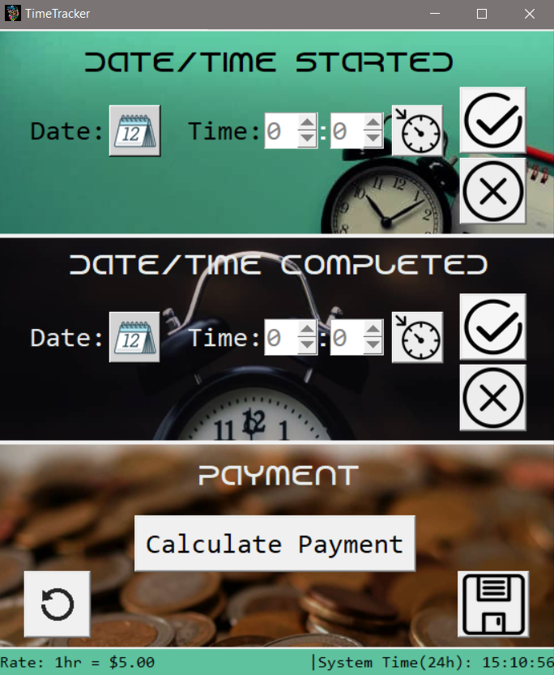
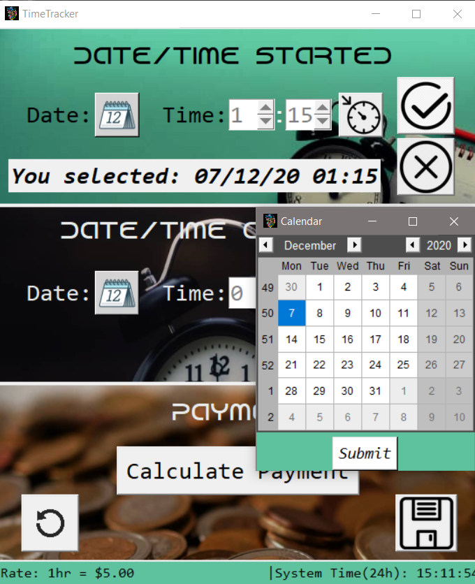
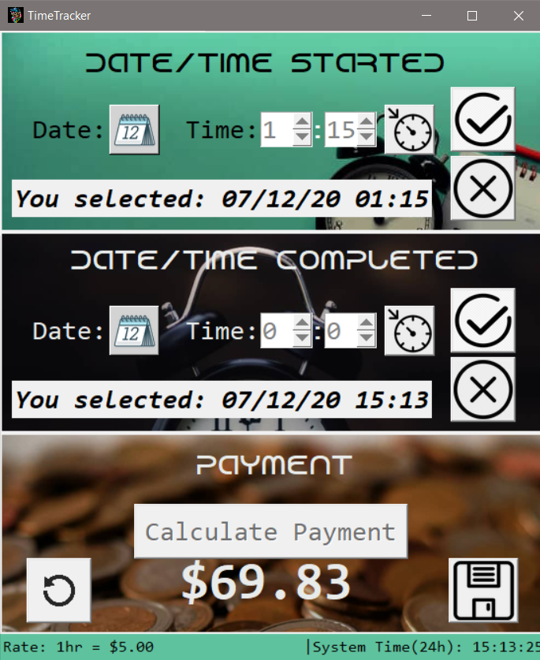
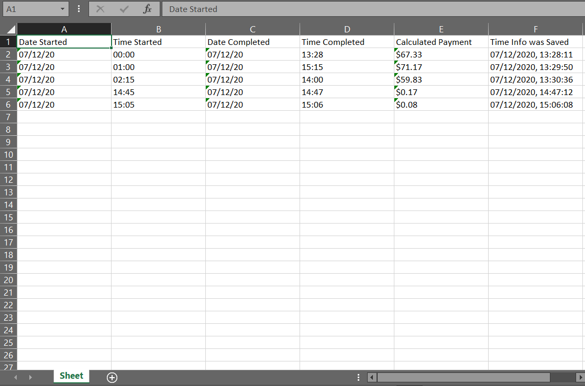

# DSC UG PYTHON CHALLENGE

App to calculate the amount a person earns per
the time spent teaching.

## REQUIREMENTS:
- Pip install [Openpyxl](https://pypi.org/project/openpyxl/)
- Pip install [Pillow](https://pypi.org/project/Pillow/)
- Pip install [tkCalendar](https://pypi.org/project/tkcalendar/1.1.5/)

## About App:
- ### General:
This is a GUI-based app using tkinter with Python. It contains widgets that are <b>statically</b>
placed on 3 canvases(`top_canvas`, `middle_canvas` and `bottom_canvas`) in the app, therefore trying
to resize the app would not work.

- ### Status Bar:
The App contains a status bar which is divided into **2 sections**: The **left
section** which gives information on a button if the mouse pointer hovers over it, and the **right section** which 
constantly tells the system time using a threaded function.

- ### Buttons and Spinboxes:
The App contains **12** total **clickable** and **animated** buttons which have various functions
and give information on their use when you hover over them,
as well as **2** spinboxes( to set the **hours** and **minutes**).
    

 

## SCREENSHOTS:

- Excel File information was saved to from App:

## DEMO:
